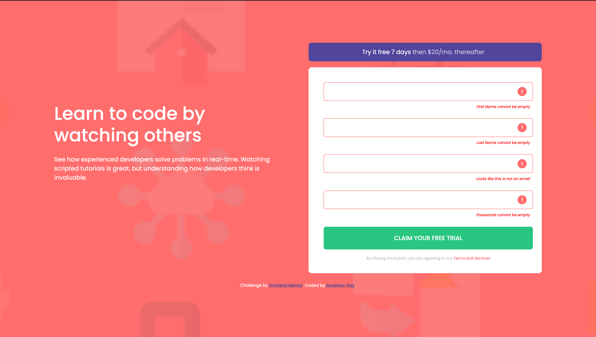
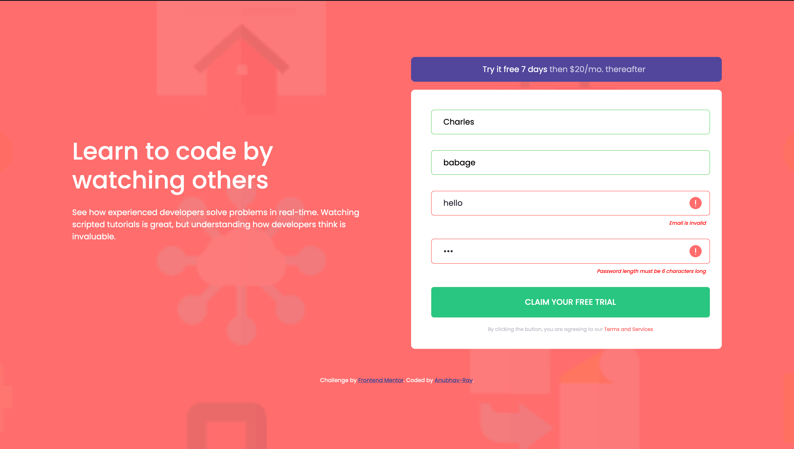
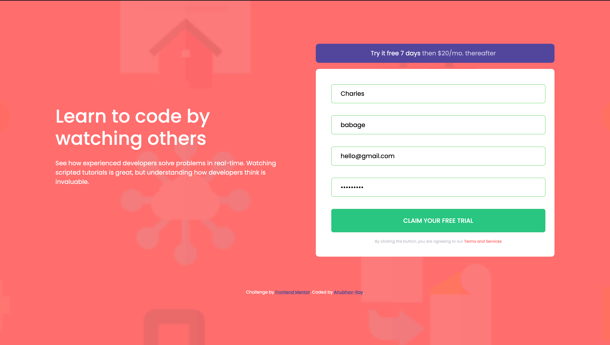
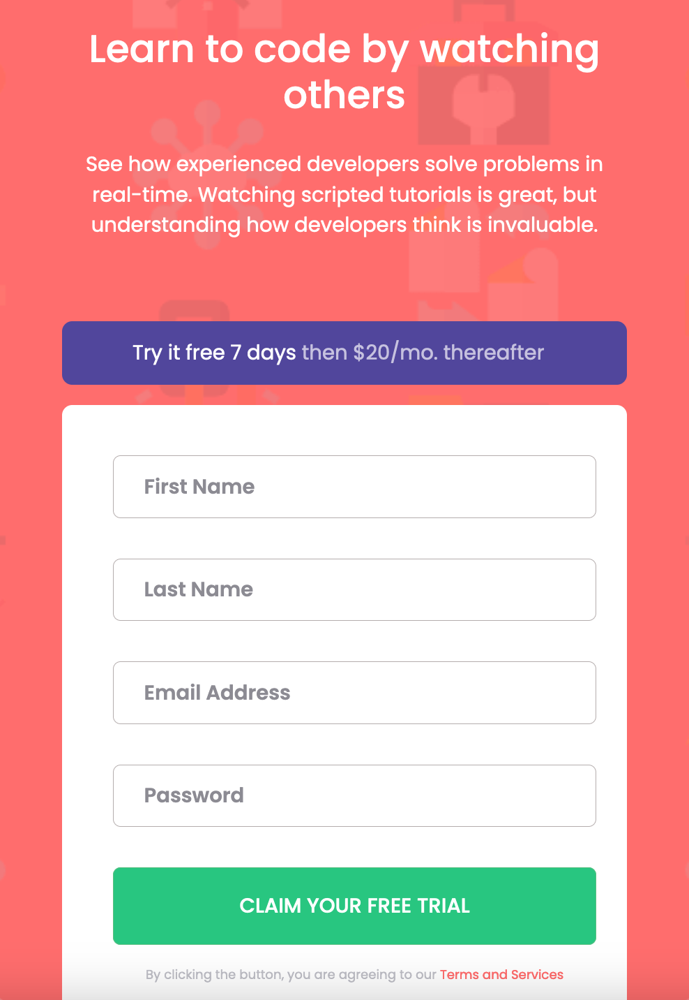
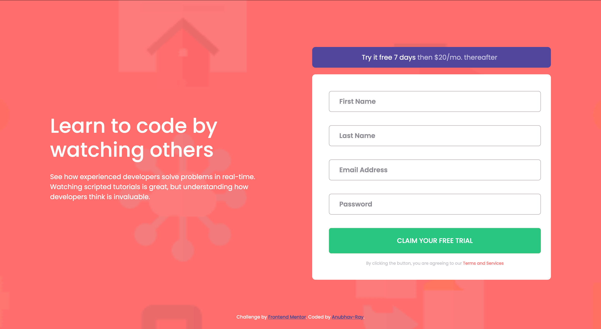

# Frontend Mentor - Intro component with sign up form

 This is a solution to the [intro-component-with-signup-form]()

## The challenge

Your challenge is to build out this introductory component and get it looking as close to the design as possible.

Your users should be able to:

- View the optimal layout for the site depending on their device's screen size
- See hover states for all interactive elements on the page
- Receive an error message when the `form` is submitted if:
  - Any `input` field is empty. The message for this error should say *"[Field Name] cannot be empty"*
  - The email address is not formatted correctly (i.e. a correct email address should have this structure: `name@host.tld`). The message for this error should say *"Looks like this is not an email"*

## Screenshot
- Error Message
 
- Error Message
  
- Success State
  
- Mobile View
 
- Desktop View

## links
- Solution URL: ()
- Live Site URL: ()

## My Process
- I first focused on making the mobile view of the given design and then styled the input elements of the form.
- My Next focus was on making the client side validation and give the appropriate message for different incorrect inputs from the user upon submission.

## Built With
- Semantic HTML5 markup
- CSS custom properties
- Bootstrap 
- Mobile-first workflow

## What I learned

- This project helped me in learning to validate the input from user using Regex.
- It also helped in learning how  to control the flow to give message for a specific input and style it accordingly.

## Continued development

- I am looking forward to take on more challenging projects to apply my JavaScript knowledge and increase my understanding of the Web Development.

## Useful resources
- [StackOverflow](https://stackoverflow.com) - Helped with  validation
- [w3Schools](https://www.w3schools.com/) - Helped me with CSS

## Author
Frontend Mentor - [@Anubhav-Ray](https://www.frontendmentor.io/profile/Anubhav-Ray)

